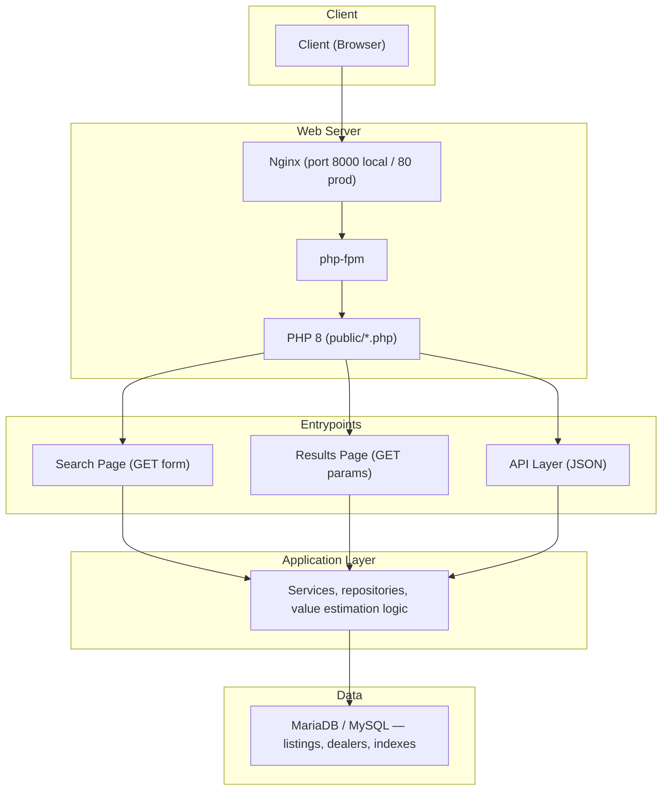
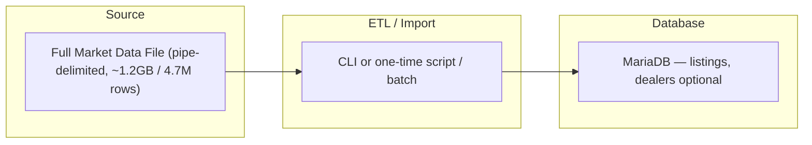
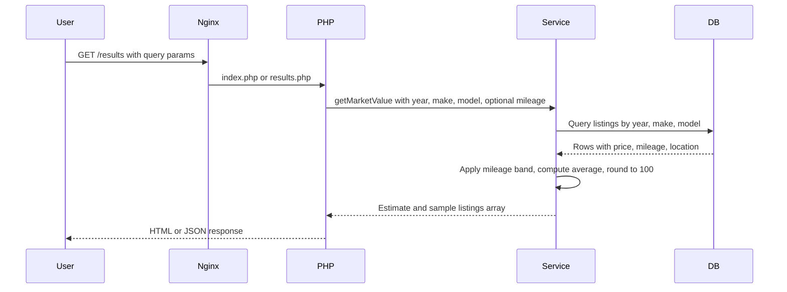
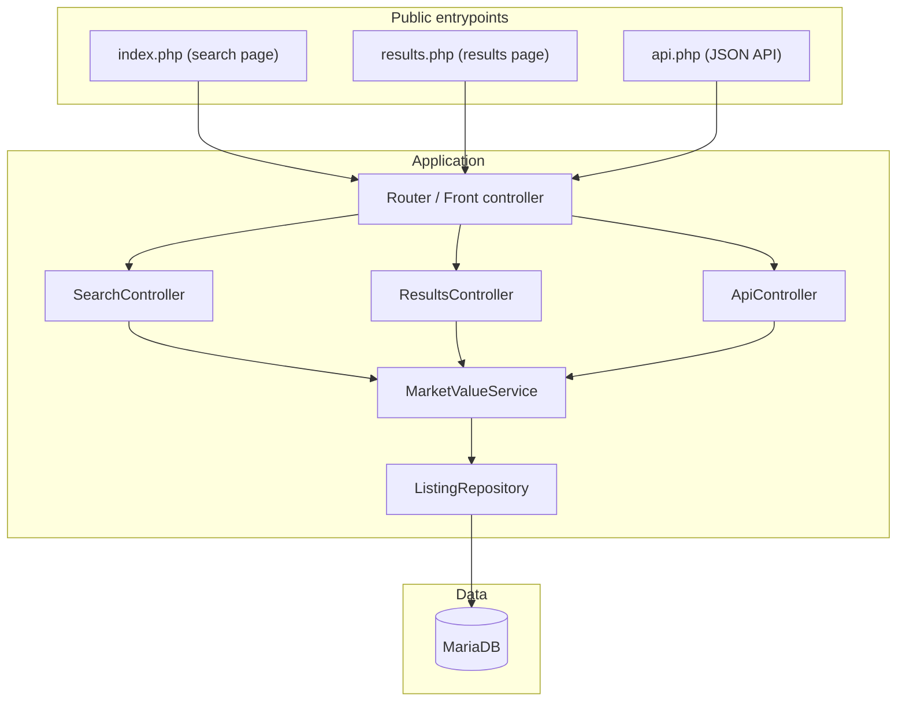
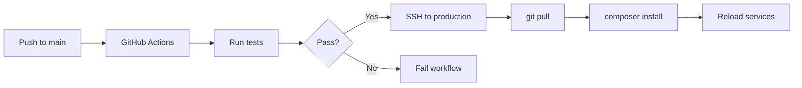

# CarValue — Technical Design Document

## 1. Objectives

- **Primary:** Provide an internal web interface to estimate average market value for a vehicle by **year + make + model**, with optional **mileage** input.
- **Data source:** A single pipe-delimited Full Market Data file (inventory listings, dealers, zip codes); market value is derived from the average of similar listings in this dataset.
- **Quality:** Clean, object-oriented PHP; standard libraries; database-backed; testable API and integration tests.
- **Deliverables:** Running web interface, this design document, organized source code, and a verified list of integration test cases.

---

## 2. Architecture & Data Flow

### 2.1 High-Level Architecture

### 2.2 Data Flow: Ingestion (File → Database)

- Input: Single file (e.g. `inventory-listing-2022-08-17.txt`).
- Process: Parse pipe-delimited rows; normalize empty/null; insert into `listings` (and optionally `dealers`); skip or flag invalid rows (e.g. missing year/make/model).
- Output: Populated tables with indexes on `(year, make, model)` and optionally `listing_mileage`, `listing_price`.

### 2.3 Data Flow: Search → Estimate → Response

- **User** submits year + make + model (required) and optionally mileage.
- **PHP** front controllers delegate to a **Service** (e.g. `MarketValueService`) that queries the DB, applies mileage logic, computes the estimate, and returns sample listings (up to 100).
- **Response:** Rendered HTML for pages or JSON for API.

### 2.4 Component Diagram

---

## 3. Challenges & Solutions

### 3.1 Mileage and Price (Negative Correlation)

- **Challenge:** Higher mileage typically means lower value; the estimate should reflect optional user mileage.
- **Solution (outline):**
  - **Mileage band:** When user provides mileage, filter (or weight) listings within a mileage band (e.g. ±20% or ±25k miles) so the average is driven by comparable mileage.
  - **Fallback:** If no mileage given, use all matching year/make/model listings for the average.
  - **Optional refinement:** Use a simple mileage adjustment (e.g. depreciation per 10k miles) applied to the base average when user mileage is provided; document formula and assumptions in this doc or in code comments.

### 3.2 Other Factors for a More Accurate Estimate

- **Trim / style:** Normalize or group by trim/style where present to avoid mixing base and premium trims.
- **Listing quality:** Prefer listings with non-null `listing_price` and, if available, exclude statuses like `in_transit` for “available” market value.
- **Outliers:** Cap or winsorize extreme prices (e.g. by percentile) so a few outliers do not skew the average.
- **Sample size:** Require a minimum number of comparable listings (e.g. ≥ 5) before showing an estimate; otherwise show a message like “Insufficient data.”
- **Location:** For a later phase, optional region/zip weighting (e.g. same state or within radius) can improve relevance.

---

## 4. Database Schemas

### 4.1 Core: `listings`

Stores one row per inventory listing from the market data file. Column names and types align with the pipe-delimited source; indexes support search and mileage filtering.

| Column                      | Type            | Notes                             |
| --------------------------- | --------------- | --------------------------------- |
| `id`                        | BIGINT UNSIGNED | PK, auto_increment                |
| `vin`                       | VARCHAR(17)     | nullable, index optional          |
| `year`                      | SMALLINT        | NOT NULL, indexed                 |
| `make`                      | VARCHAR(64)     | NOT NULL, indexed                 |
| `model`                     | VARCHAR(128)    | NOT NULL, indexed                 |
| `trim`                      | VARCHAR(128)    | nullable                          |
| `dealer_name`               | VARCHAR(255)    | nullable                          |
| `dealer_street`             | VARCHAR(255)    | nullable                          |
| `dealer_city`               | VARCHAR(128)    | nullable                          |
| `dealer_state`              | VARCHAR(16)     | nullable                          |
| `dealer_zip`                | VARCHAR(16)     | nullable                          |
| `listing_price`             | DECIMAL(12,2)   | nullable; used for average        |
| `listing_mileage`           | INT UNSIGNED    | nullable; used for mileage filter |
| `used`                      | TINYINT(1)      | nullable (TRUE/FALSE in file)     |
| `certified`                 | TINYINT(1)      | nullable                          |
| `style`                     | VARCHAR(128)    | nullable                          |
| `driven_wheels`             | VARCHAR(64)     | nullable                          |
| `engine`                    | VARCHAR(128)    | nullable                          |
| `fuel_type`                 | VARCHAR(64)     | nullable                          |
| `exterior_color`            | VARCHAR(64)     | nullable                          |
| `interior_color`            | VARCHAR(64)     | nullable                          |
| `seller_website`            | VARCHAR(512)    | nullable                          |
| `first_seen_date`           | DATE            | nullable                          |
| `last_seen_date`            | DATE            | nullable                          |
| `dealer_vdp_last_seen_date` | DATE            | nullable                          |
| `listing_status`            | VARCHAR(64)     | nullable (e.g. in_transit)        |
| `created_at`                | TIMESTAMP       | default CURRENT_TIMESTAMP         |

**Indexes (conceptual):**

- `(year, make, model)` — main search.
- Optional: `(year, make, model, listing_mileage)` or `listing_mileage` for mileage-band queries.
- Optional: `listing_price` for excluding nulls or outlier logic.

### 4.2 Optional: `dealers`

If dealer data is normalized for reuse or reporting:

| Column    | Type             |
| --------- | ---------------- |
| `id`      | INT UNSIGNED, PK |
| `name`    | VARCHAR(255)     |
| `street`  | VARCHAR(255)     |
| `city`    | VARCHAR(128)     |
| `state`   | VARCHAR(16)      |
| `zip`     | VARCHAR(16)      |
| `website` | VARCHAR(512)     |

`listings.dealer_id` FK optional; for minimal scope, dealer fields can stay only in `listings`.

### 4.3 Location Display

“Location” on the results page is derived from `dealer_city` and `dealer_state` (e.g. “Seattle, WA”). No separate table required for display.

---

## 5. API Endpoints & Tests

### 5.1 API Endpoints (JSON)

- **GET** `/api.php?year=2015&make=Toyota&model=Camry&mileage=150000`  
  - **Response:** JSON with `estimated_value` (rounded to nearest hundred), `sample_listings` (array, up to 100 items), and optional `total_matches`, `message` (e.g. “Insufficient data”).
- **GET** `/api.php?year=2015&make=Toyota&model=Camry`  
  - Same without mileage; backend uses all matching listings (or documented default behavior).
- **Validation:** 400 if required params missing or invalid (e.g. non-numeric year); 404 optional for “no data”; 200 with empty list or message when no listings found.

### 5.2 Integration Tests (Verified List)

Tests verify behavior end-to-end (HTTP request → DB → response) or against the service layer with a test DB/fixtures.

1. **Search by year/make/model only** — returns 200, `estimated_value` is number, `sample_listings` is array; value is average of matching listings rounded to nearest hundred.
2. **Search with mileage** — same search with `mileage` param; result set or average reflects mileage band (e.g. fewer listings, different average).
3. **No matches** — year/make/model with no rows in DB returns 200 with empty or zero estimate and empty `sample_listings` (or explicit “Insufficient data” message).
4. **Missing required params** — request without year, make, or model returns 400.
5. **Invalid params** — invalid year (e.g. non-numeric) returns 400.
6. **Sample listing shape** — each item in `sample_listings` includes vehicle description (year/make/model/trim), price, mileage, and location (city, state).
7. **Sample cap** — number of items in `sample_listings` ≤ 100.
8. **Listings with null price** — listings without `listing_price` excluded from average and optionally from sample list (documented behavior).

---

## 6. Frontend Pages

### 6.1 Search Page

- **URL:** `/` or `/index.php`.
- **Content:** Simple form:
  - **Input 1 (required):** Year + Make + Model (e.g. single combined field “2015 Toyota Camry” or three separate fields).
  - **Input 2 (optional):** Mileage (e.g. “150,000 miles”).
- **Action:** GET submit to results page (or POST with redirect to keep URLs shareable; GET preferred for shareability).
- **Layout:** Clean, aligned, spaced; no heavy styling required per requirements.

### 6.2 Results Page

- **URL:** `/results.php?year=2015&make=Toyota&model=Camry&mileage=150000` (or equivalent).
- **Content:**
  - **Estimated market price:** Single value, rounded to nearest hundred (e.g. “$13,800”).
  - **Sample listings table:** Up to 100 rows; columns: Vehicle (year make model trim), Price, Mileage, Location (city, state).
- **Edge cases:** Message when no data (“Insufficient data for estimate”) and link back to search.

---

## 7. File Paths (Lowercase and Naming Convention)

Use **lowercase** filenames and **hyphens** for multi-word names (e.g. `lower-case-files.php`) to keep URLs and filesystem consistent and avoid case-sensitivity issues across environments.

- **Public entrypoints (document root):**
  - `public/index.php` — search page.
  - `public/results.php` — results page.
  - `public/api.php` — JSON API.
- **Application (outside public):**
  - `src/` or `app/` for PHP classes (e.g. `MarketValueService`, `ListingRepository`).
  - `config/` for DB and app config.
  - `scripts/` or `bin/` for CLI import (e.g. `import-listings.php`).
- **Assets (optional):**
  - `public/css/`, `public/js/` if needed; filenames lowercase with hyphens (e.g. `search-form.css`).

Nginx points **document root** to `public`; only `public/*.php` and static assets are exposed. All business logic lives under `src/` (or equivalent) and is included by the entrypoints.

---

## 8. Deployment Actions (GitHub Actions)

### 8.1 Goals

- Run tests on push/PR.
- Optionally deploy to production VM (e.g. `moaz-carvalue.linkgrid.dev`) via SSH and deploy key stored in repo secrets.

### 8.2 Workflow Outline

- **Trigger:** Push to main (or default branch); pull_request to main.
- **Jobs:**
  1. **Test:** Run PHPUnit (or project test runner) for unit and integration tests; fail the workflow if tests fail.
  2. **Deploy (optional):** On push to main, SSH to production host using `SSH_KEY` secret; pull latest code from repo; run any deploy steps (e.g. `composer install --no-dev`, clear opcache, reload php-fpm if needed).
- **Secrets:** `SSH_KEY` (private key for `root@moaz-carvalue.linkgrid.dev`); optionally `DB_`* for test DB in CI.
- **Environments:** Production path on server: `/home/moaz-carvalue.linkgrid.dev`; public: `/home/moaz-carvalue.linkgrid.dev/public`.

### 8.3 Deployment Steps (on server)

1. `cd /home/moaz-carvalue.linkgrid.dev`
2. `git pull origin main` (or appropriate branch).
3. `composer install --no-dev --optimize-autoloader` (if Composer used).
4. Optionally: restart php-fpm or clear opcache for PHP changes to take effect.
5. No DB migrations in this step unless a migration runner is introduced; data load is assumed one-time or separate process.

### 8.4 Diagram

---

## 9. Summary

| Area             | Summary                                                                                                                 |
| ---------------- | ----------------------------------------------------------------------------------------------------------------------- |
| **Objectives**   | Internal car value estimate by year/make/model (+ optional mileage); DB-backed; clean OOP PHP.                          |
| **Architecture** | Nginx → php-fpm → PHP entrypoints → application layer → MariaDB; single data file ingested into DB.                     |
| **Challenges**   | Mileage handled via mileage band (and optional adjustment); other factors: trim, outliers, sample size, listing_status. |
| **Database**     | `listings` table mirrors source file; indexes on (year, make, model) and optionally mileage/price.                      |
| **API**          | GET `/api.php` with year, make, model, optional mileage; JSON with estimate and sample_listings.                        |
| **Frontend**     | Search page (form); results page (estimate + table of up to 100 listings).                                              |
| **File paths**   | Lowercase, hyphenated names; document root `public/`; logic in `src/` or `app/`.                                        |
| **Deployment**   | GitHub Actions: test on push/PR; deploy to VM via SSH on push to main.                                                  |

This document provides the high-level outline; implementation details (exact class names, SQL, and CI YAML) are left to the codebase.